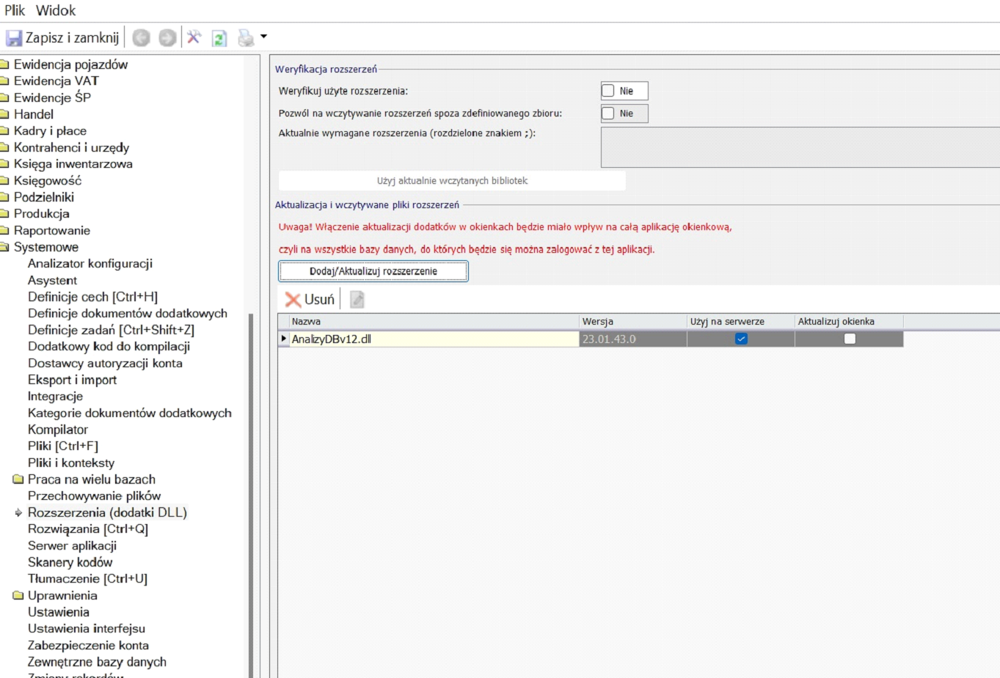
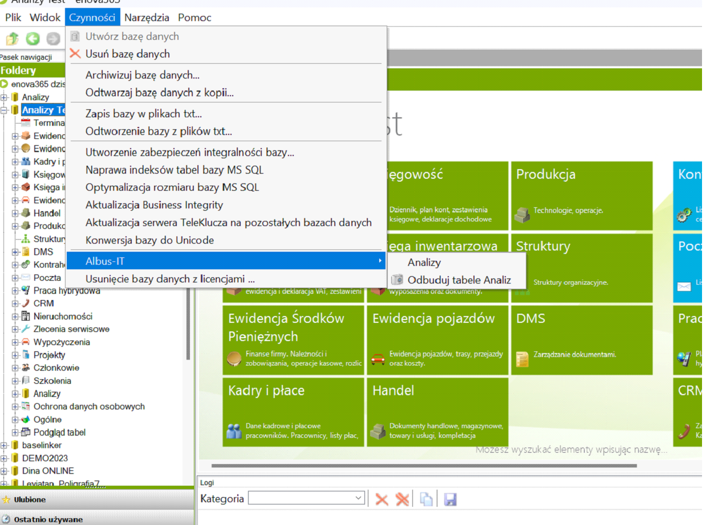
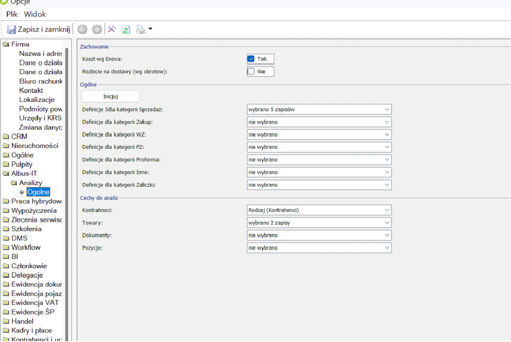
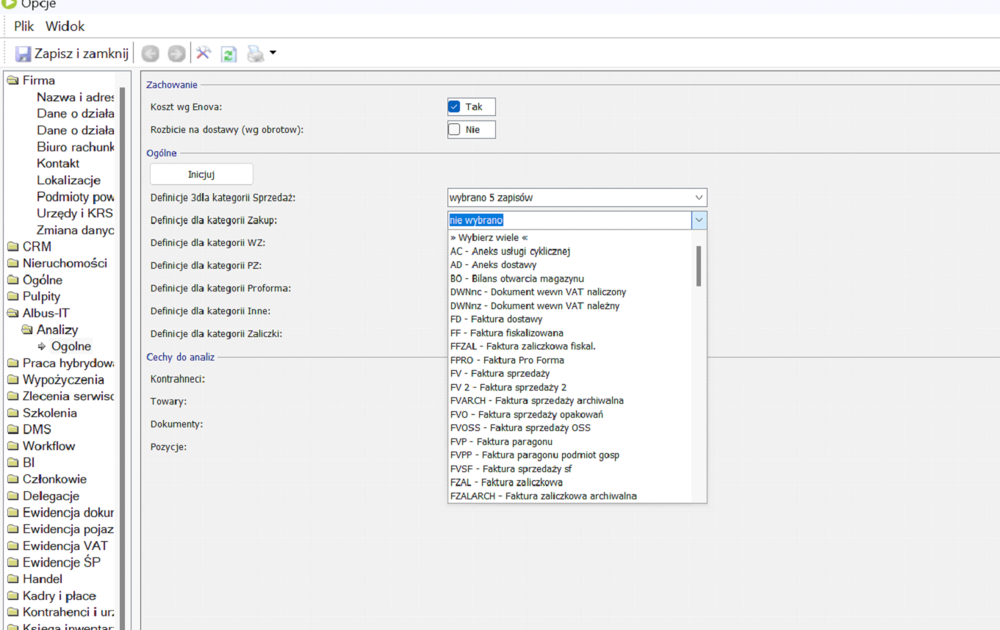
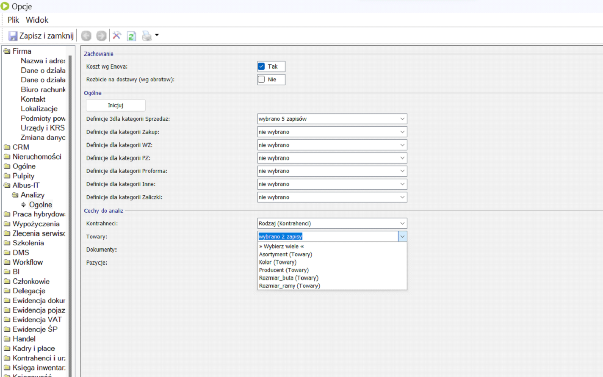

# Konfiguracja

## Instalacja Oprogramowania
Instalację rozpoczynamy poprzez wgranie odpowiedniego pliku .dll do Enova 365.

<figure markdown>

</figure>

Po przelogowaniu się użytkownika moduł zacznie już funkcjonować w ERP Enova365.  
Widoczny będzie jako kolejna linia w zakładce „Czynności”

<figure markdown>

</figure>

## Ustawienia Enova365

Kolejny etap przy instalacji to konfiguracja modułu analiz i wybranie parametrów, które nas interesują.

<figure markdown>

</figure>

Wybieramy poszczególne pola i definiujemy dokumenty , które chcemy aby moduł w tle przeliczał w naszym module

<figure markdown>

</figure>

Następnie wybieramy pozostałe informacje z dostępnych cech , a ich wybór daje nam wiele możliwości

<figure markdown>

</figure>

