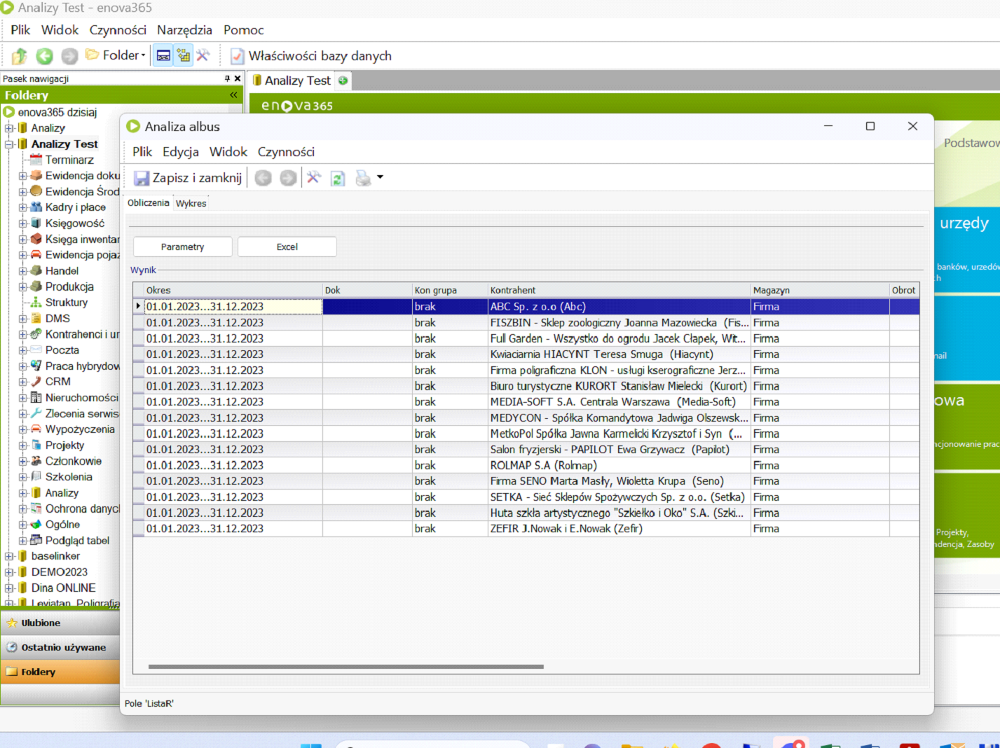

# Tworzenie Analiz
Po ukończeniu konfiguracji możemy przejść do etapu tworzenia naszych analiz.

<figure markdown>

</figure>

## Odbudowa Tabel
Pierwsza funkcja to odbudowa tabel, które wybraliśmy podczas konfiguracji programu. Po tym zabiegu możemy przystąpić do wykonywania analiz.

<figure markdown>

</figure>

## Wykonywanie Analiz

Wybieramy okres, który nas interesuje, rozbicie na miesiące. Dodatkowo czy ma to być analiza w rozbiciu na np. sprzedaż wartościowo, czy w rozbciu na towar lub kontrahentów.

<figure markdown>

</figure>

Oczywiście jest możliwość wyboru tylko wybranych grup lub kontrahentów do naszej analizy.

<figure markdown>

</figure>

Po ustawieniu tych parametrów wciskamy przycisk przelicz i otrzymujemy analizę. Mamy możliwość, aby wyświetlić ją na ekranie w formie liczbowej lub wykresu. Można też eksportować ją do excela i dokonywać dodatkowych operacji do wygenerowanych danych.

<figure markdown>

</figure>

Istnieje również możliwość skorzystania z przycisku excel. Daje to możliwość skorzystania ze wcześniej przygotowanych szablonów najczęściej przez nas wykorzystywanych.

<figure markdown>

</figure>

