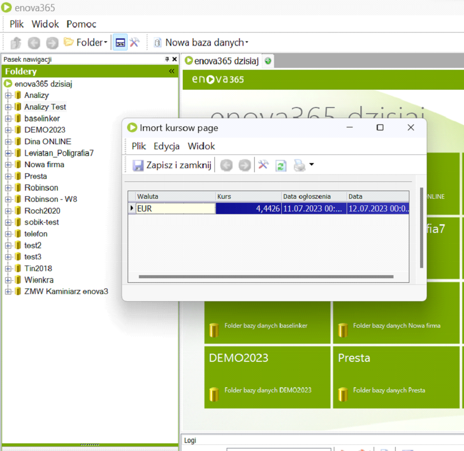

# Opis Modułu

<b>Prosty moduł do automatycznego pobierania aktualnych kursów walut NBP</b> 

Firmy, które często współpracują z podmiotami zagranicznymi, dokonując zakupów lub sprzedaży w walucie innej niż polski złoty muszą pobierać aktualny kurs waluty. 

Nasz moduł przy pierwszym logowaniu się do ENOVA365 wymusza pobranie aktualnej tabeli kursów walut na dany dzień i ich zaakceptowaniu. 

Dzięki temu prostemu modułowi nie musimy ręcznie wprowadzać aktualnych kursów, a dodatkowo mamy pewność, że sprzedaż będzie odbywała się po kursie waluty aktualnym w danym dniu.

<figure markdown>

</figure>