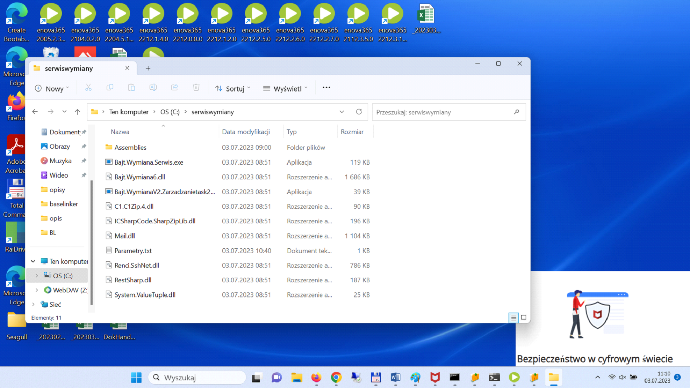
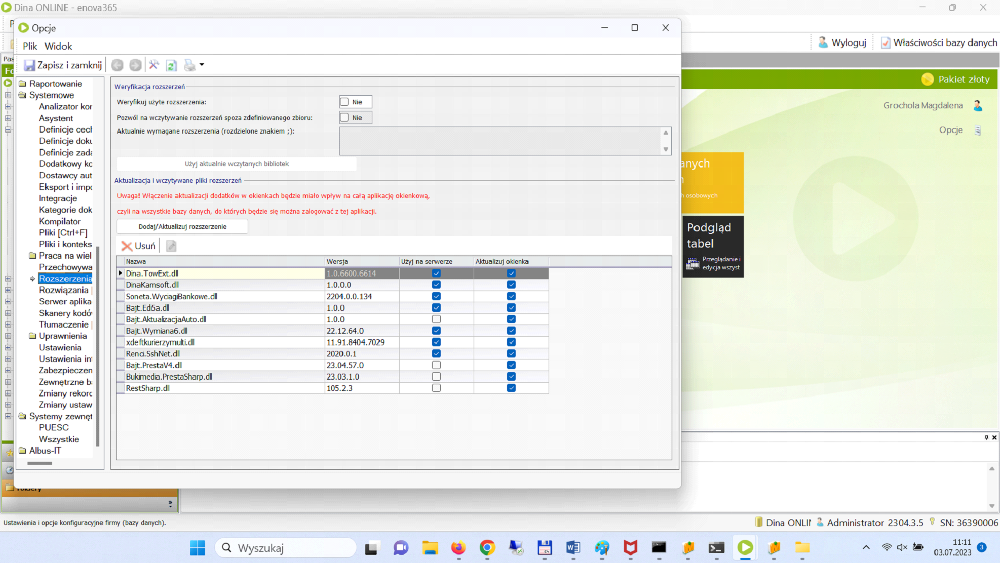
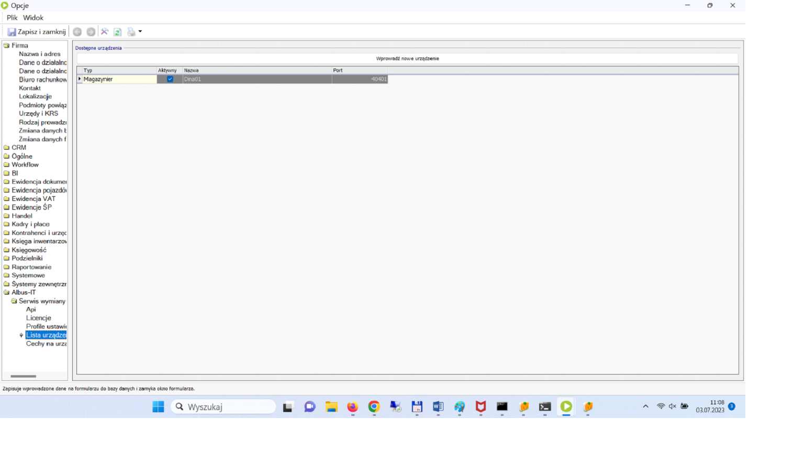
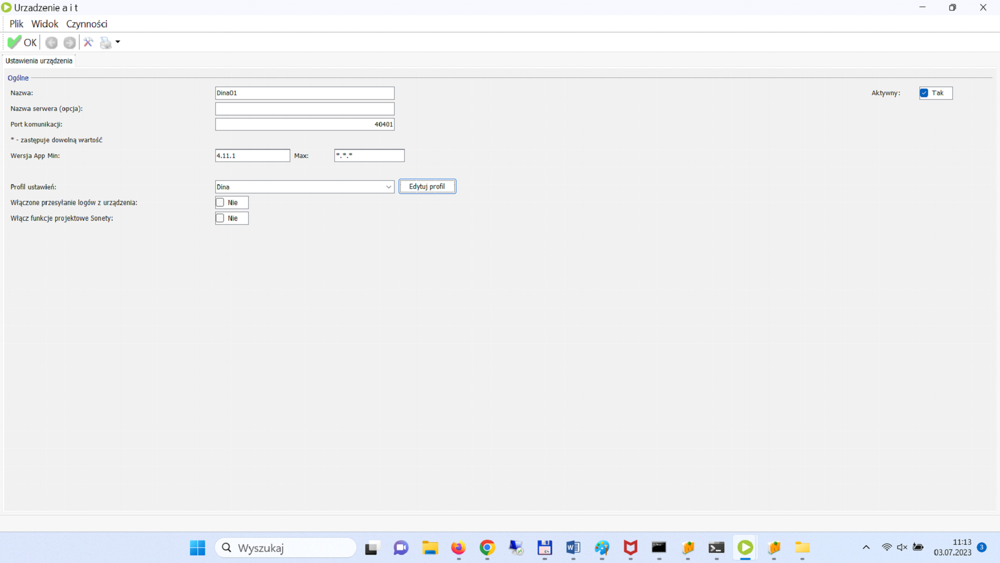

# Konfiguracja

Do sprawnego działania naszego oprogramowania wymagana jest <b>najnowsza</b> wersja oprogramowania ERP Enova365. 
Kolektory powinny posiadać system Android w wersji <b>większej bądź równej API 21</b>.

## Instalacja Oprogramowania
Do katalogu C:\Serwiswymiany wgrywamy pliki dostarczone przez ALBUS-IT. 
magazynierINSTALACJA

<figure markdown>

</figure>

## Ustawienia Enova365
Kolejną czynnością jest podpięcie odpowiednich plików z rozszerzeniem dll do systemu ERP ENOVA 365.

<figure markdown>

</figure>

Następnym krokiem jest konfiguracja połączenia terminala z z serwerem.
Ustala się port, na którym będzie odbywała się transmisja danych.

  
   

## Uruchamianie i konfiguracja modułu Serwis Wymiany ALBUS-IT
Uruchamiamy Aplikację Serwis wymiany zarządzanie. 