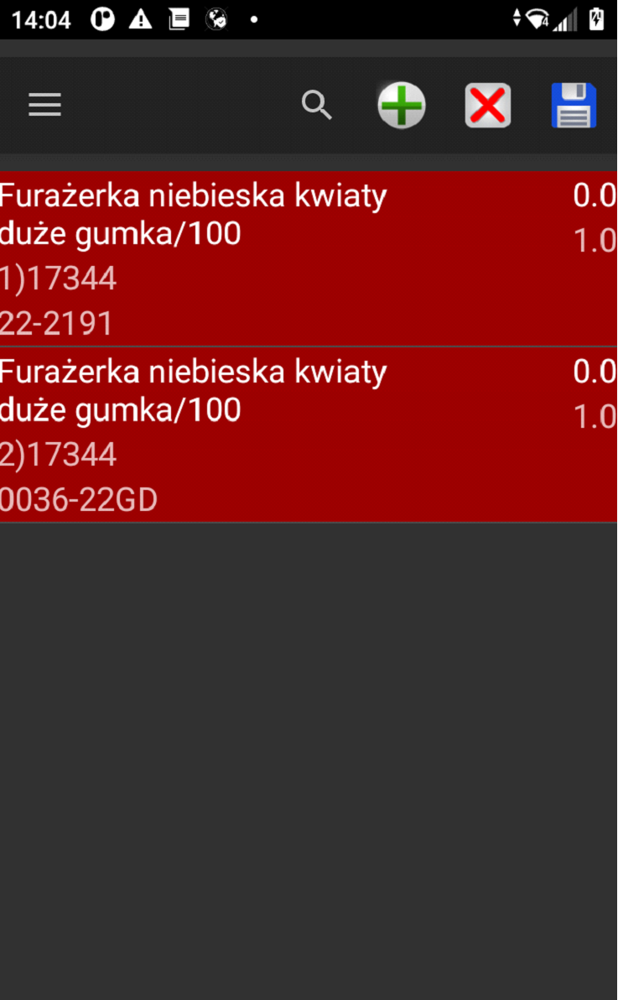

# Realizacja zamówień
W przypadku przyjęcia zamówienia do magazynu na podstawie dokumentów dostawy 

Krok pierwszy to wybór typu dokumentu jako Przychód oraz typ dokumentu zdefiniowany jako ZD. Przejście przyciskiem „dalej ” otwiera nam możliwość czytania kodów kreskowych producenta towaru oraz podania ilości towaru. 

Przycisk ze znaczkiem (+) daje możliwość dodania kolejnego towaru do przyjęcia. Gdy cały dokument przyjęcia jest gotowy jak na zdjęciu poniżej 

Dyskietką w prawym górnym rogu zapisujemy dokument . w tym etapie pozostaje na wysłać stworzony dokument do serwera . Po czym powstanie w systemi ENOVA365 odpowiedni dokument zakupu.

<figure markdown>

</figure>
