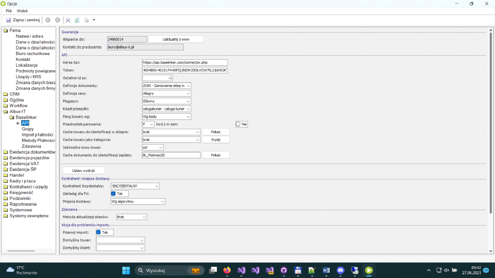
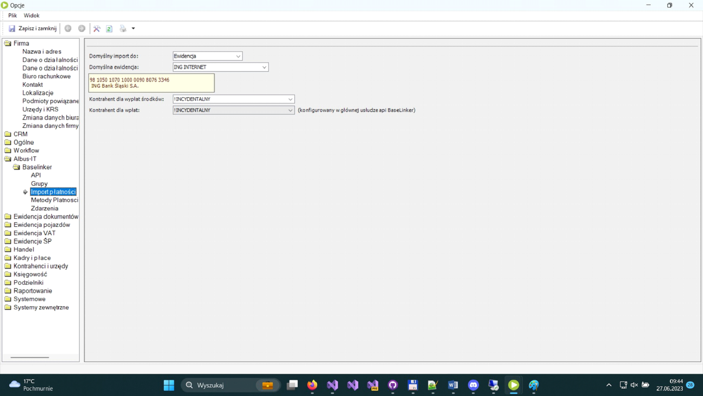
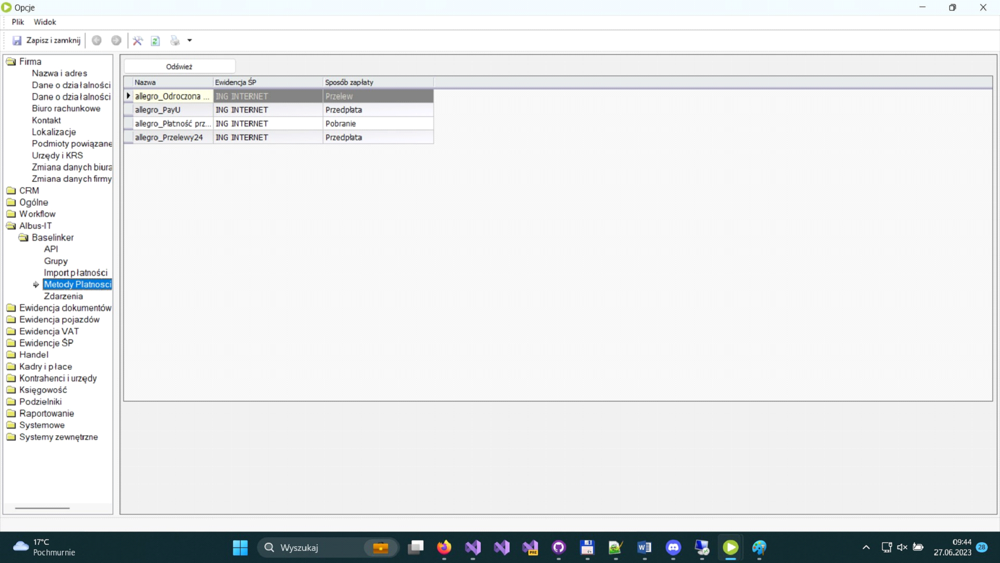

# Konfiguracja

## Klucz API

Konfiguracja modułu ALBUSIT4 for [BaseLinker](https://baselinker.com/) jest prosta i intuicyjna, polega na wprowadzeniu klucza API, który uzyskujemy z platformy [BaseLinker](https://baselinker.com/). Aby uzyskać klucz API musimy założyć konto [BaseLinker](https://baselinker.com/) i zalogować się do panelu administracyjnego. W zakładce Moje Konto należy wygenerować klucz API do naszego modułu i skopiować go.

## Połączenie z Enova365

Kolejną czynnością przy konfiguracji naszego dodatku jest wprowadzenie unikalnego klucza skopiowanego wcześniej ze strony [BaseLinker](https://baselinker.com/). Należy wprowadzić go w odpowiednie pole programu Enova 365.

<figure markdown>

<figcaption>Po zapisaniu danych możliwa jest synchronizacja danych.</figcaption>
</figure>

## Konfiguracja Modułu

W tym samym oknie ustalamy dodatkowe informacje o sposobie wymiany danych między baselinker, a naszym modułem. Czyli na podstawie jakiej cechy będą rozpoznawane towary, stany magazynowe oraz klienci. Istnieje możliwość ustawienia domyślnej ceny wysyłki towaru oraz wybór firmy kurierskiej. Dodatkową opcją, którą należy zdefiniować to forma płatności oraz bank, który będzie obsługuje oraz domyślny klient, na którego księgowane będą wpłaty na nasze konto. W przykładowym screenie jest to klient „Incydentalny” służy do tego zakładka – Import płatności.

<figure markdown>

</figure>

W kolejnej zakładce „Metody płatności” ustalamy dopuszczone przez nas formy płatności. Konfigurujemy je poprzez dodanie nowej formy płatności np. Pobranie , przelew lub inną.

<figure markdown>

</figure>

Ostatnia zakładka - „zdarzenia” odpowiada za konfigurację statusów, które będą aktualizowane na stronie [BaseLinker](https://baselinker.com/). (np. przyjęcie do realizacji, informacja o wysyłce towaru, nr listu przewozowego itp.)
