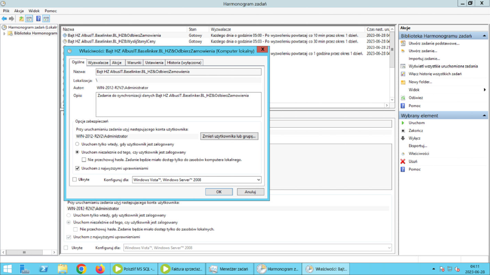
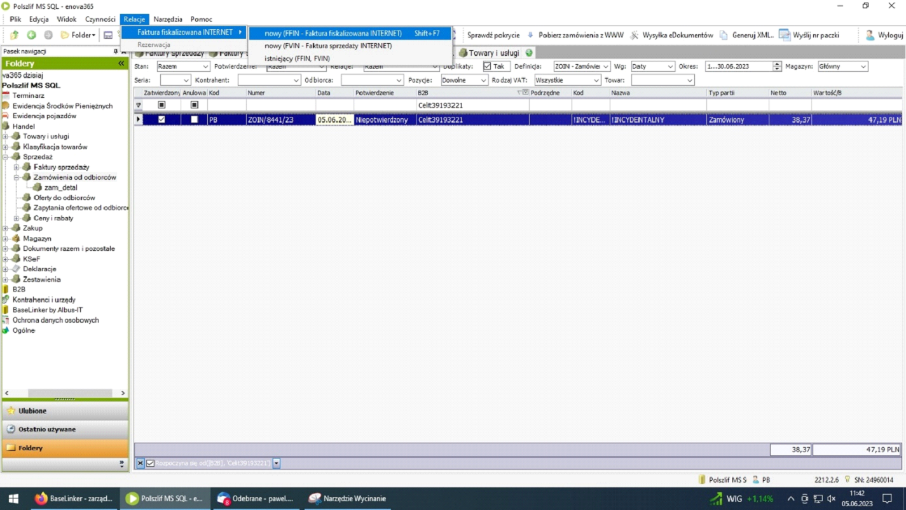
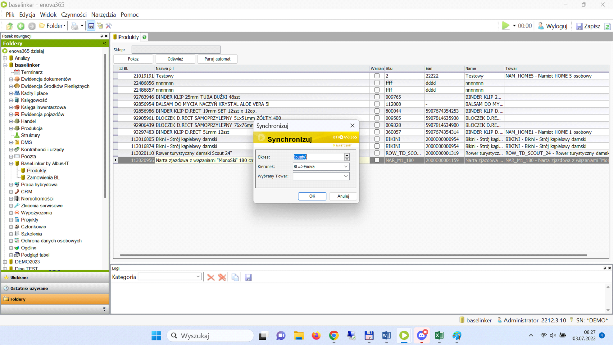
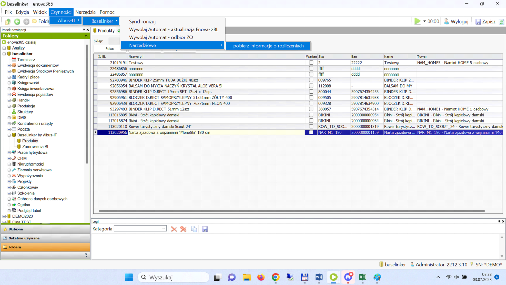
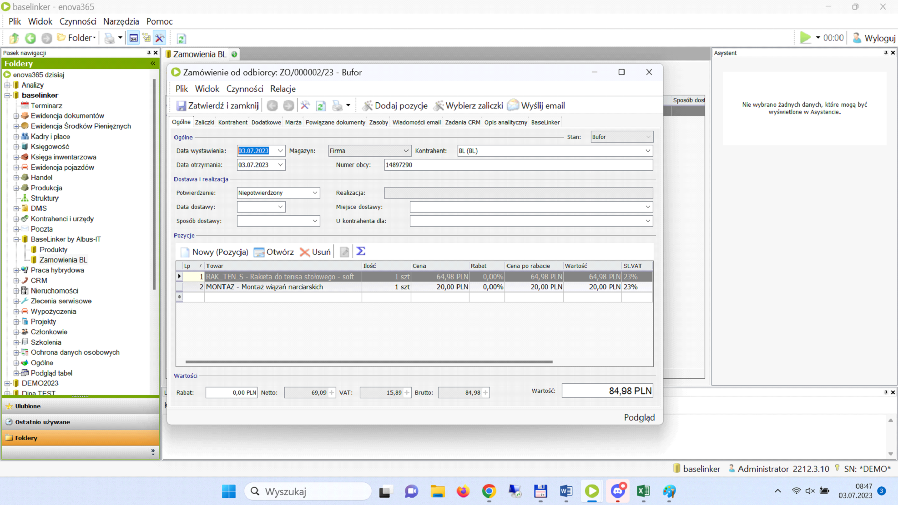

# Zamówienia

Główny ekran programu to lista zaimportowanych zamówień.

## Automatyczne pobieranie zamówień z systemu

Zamówienia pobierane są w zależności od konfiguracji programu. Opcja najczęściej wybierane tzw. Automatycznie pobiera do systemu wszystkie zamówienia.

<figure markdown>

</figure>

## Ręczne pobieranie zamówień z systemu

Drugą opcją jest importowanie wybranych zamówień ręcznie podając ID zamówienia lub nazwę odbiorcy.

<figure markdown>

</figure>

## Synchronizacja towarów

Zakładka w której należy skonfigurować i zsynchronizować towary między Enova ERP a systemem [BaseLinker](https://baselinker.com/).

<figure markdown>

<figcaption>Opcja umożliwia przesyłanie towarów oraz cen. Do wyboru jest opcja automatyczna z nadpisaniem stanów lub wybór synchronizacji ręczny, gdzie wybieramy tylko interesujące nas produkty.</figcaption>
</figure>

## Lista płatności

Wybierając funkcje pobierz listę płatności (plik TXT z wydruku bankowego) - automatycznie aktualizujemy status płatności w zamówieniach pobranych z [BaseLinker](https://baselinker.com/).

<figure markdown>

</figure>

## Zmiana statusu zamówienia

Po wykonanych czynnościach przy zamówieniu i np. przekształcając z dokumentu ZO w dokument WZ automatycznie zmienia się status w [BaseLinker](https://baselinker.com/) zgodnie ze wstępnie skonfigurowaną akcją.
Po zaimportowaniu wszystkich lub interesujących nas zamówień z [BaseLinker](https://baselinker.com/) do ERP Enova tworzymy dokumenty ZO.

<figure markdown>

<figcaption>Po zaakceptowaniu dokumentu następuje zmiana statusu i tworzy się dokument nad którym pracujemy tylko w Enova.</figcaption>
</figure>
